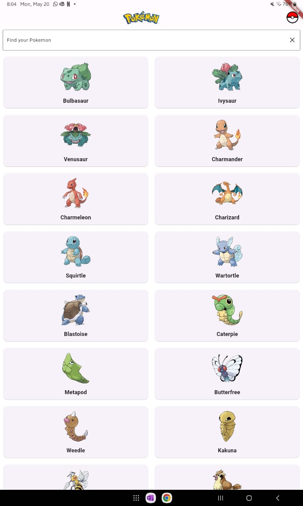
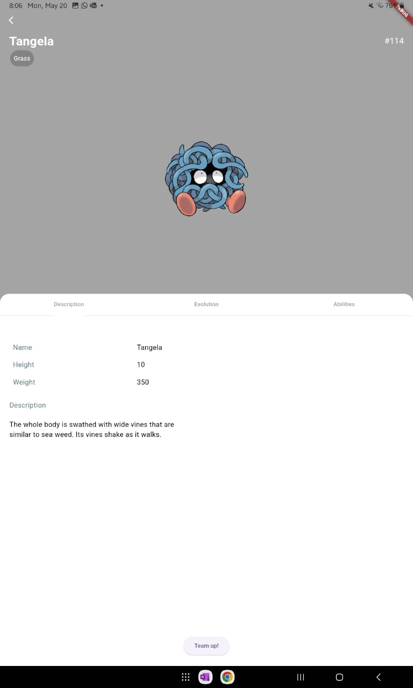
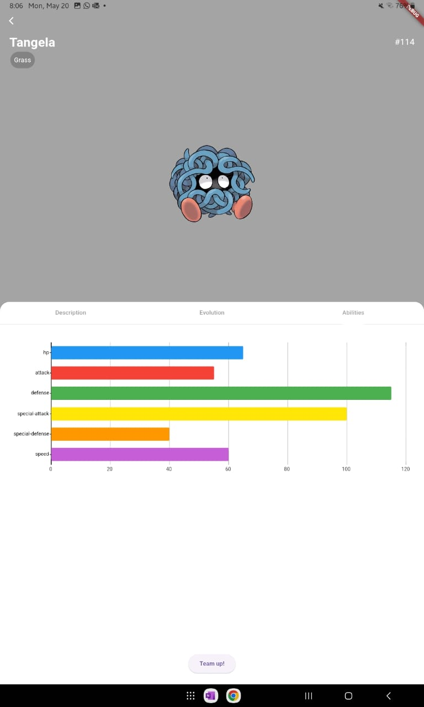
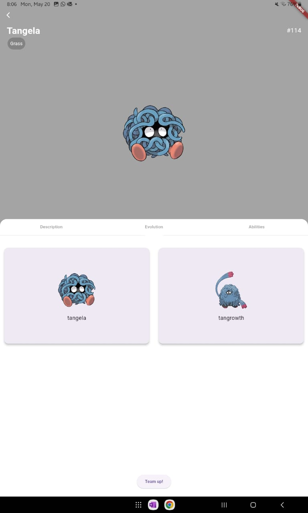
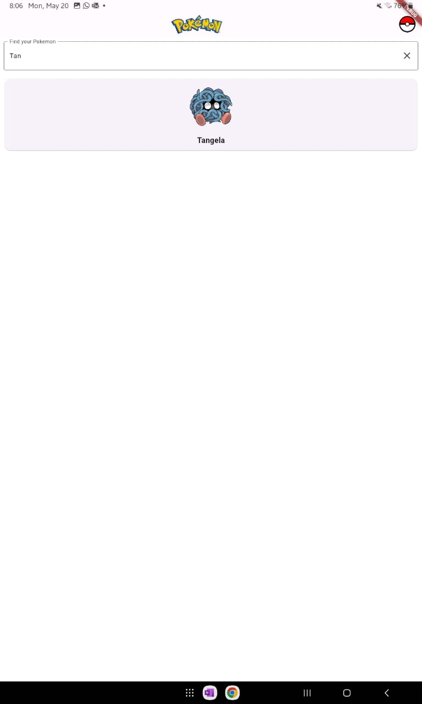
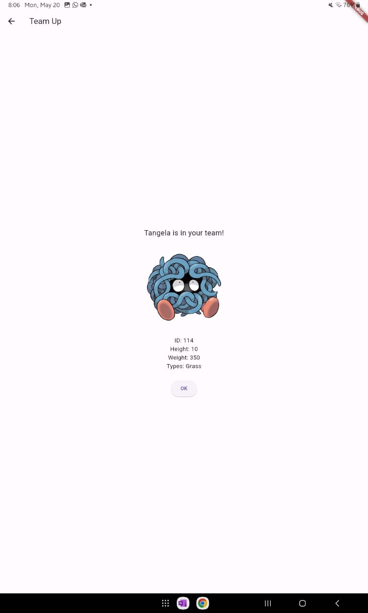
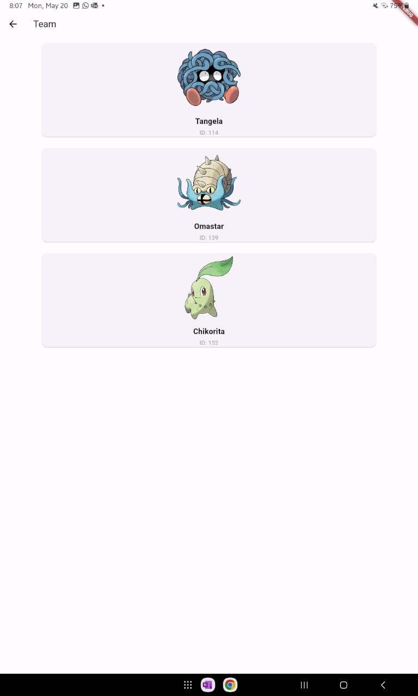

# Pokedex

Pokédex app built with Flutter and the Pokémon API.

## Overview

This project is a comprehensive Pokédex application designed to provide detailed information on Pokémon species, characteristics, abilities, and evolution. With a sleek and user-friendly interface, it features:

- **Main page**:

  <p align="center">
    
  </p>

- **Detailed Pokémon information**: Access in-depth details about each Pokémon, abilities, and evolutionary lines.

  <p align="center">
    
    
    
  </p>

- **Search and filter functionality**: Easily find specific Pokémon by name or filter them based on criteria such as type, generation, or region.

  <p align="center">
    
  </p>

- **Team builder**: Create and manage your own Pokémon teams for strategic planning.

  <p align="center">
    
    
  </p>

## Acknowledgements

- Flutter
- Pokémon API

## Getting Started

### Prerequisites

- Flutter SDK: [Install Flutter](https://flutter.dev/docs/get-started/install)
- A code editor (e.g., VS Code, Android Studio)

### Installation

1. Clone the repository:
   ```sh
   git clone https://github.com/KarinaJoanna/pokedex.git


